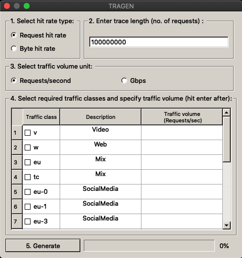

## TRAGEN

TRAGEN is a tool that produces synthetic traces that have similar caching properties as the original traces in the sense that the two traces will have the same hitrates in a cache simulation. TRAGEN is seeded with realistic footprint descriptor models [[1]](#1) computed from original traces from Akamai's production CDNs that models the caching properties of the original traces. Using the footprint descriptors, TRAGEN produces a synthetic trace that fits the model.

## Installation

1. TRAGEN requires the installation of [python3](https://www.python.org/downloads/).

2. TRAGEN requires the following packages to be installed - numpy, scipy, pyQt5 and datetime.
   * ``` pip3 install numpy, scipy, pyQt5, datetime ```

## Synthetic trace generation

In this mode, the user can select a traffic model from the [available traffic models](#available-traffic-models) to produce a synthetic trace that fits the model. The user can select a model that is described as Mix to generate a synthetic trace that is representative of the original trace obtained from a server that is serving a mix of traffic classes. Or, the user can select multiple traffic models and provide the required traffic volumes for each selected option to create his/her own traffic mix. For e.g., 10Gbps of traffic from Amazon mixed with 5Gbps of traffic from Microsoft. We provide the option of using a GUI or a command line interface.

### GUI

Run the following command in the home directory of TRAGEN to operate in the GUI mode.
   * ``` python3 tragen_gui.py ```

You would see the following GUI. 



1. **Select hit rate type**. Select if the synthetic trace is to have the same Request hit rate or Byte hit rate as the original.
2. **Enter trace length**. Specify the number of requests in the synthetic trace.
3. **Select traffic volume unit**. Select if the traffic volume field in the third column of the table will be input as requests/second or Gigabits per second (Gbps).
4. **Select required traffic classes and specify the traffic volume**. Select traffic classes from the first column of the table and specify a traffic volume for the selected traffic classes in the third column of the table.  The synthetic trace will be similar to  original production traffic with the specified mix. The second column provides a description of each choice. Each choice is either a pure traffic class  such as video, web, or social media traffic class. Or, it is a traffic mix itself, e.g., EU a mix of all traffic served by a cache located in Europe in the production CDN.
5. **Generate**. Hit the generate button and TRAGEN will start producing the synthetic trace.

The produced synthetic trace is found in the directory ./OUTPUT/

### Command line interface (CLI)

Run the following command in the home directory of TRAGEN to operate in the CLI mode.
   * ``` python3 tragen_cli.py -c <config_file> -d <output_directory> ```

The config file is to be in the json format. An example of a config file is:

```json
{
    "Trace_length": "100000000",
    "Hitrate_type": "bhr",
    "Input_unit"  : "reqs/s",
    "Traffic_classes" : [
        {
            "traffic_class": "v",
            "traffic_volume": "1000"
        },
        {
            "traffic_class":"w",
            "traffic_volume":"2000"
        }
    ]
}
```

## Produce and submit traffic models


## Developer mode.

We welcome users to suggest modifications to improve the quality of the code or add new features to the existing codebase. Use the developer branch to make edits and submit a change.


## Available traffic models


## Cite

Please cite the following publication on using TRAGEN for your work.

TRAGEN: A Synthetic Trace Generator for Realistic Cache Simulations.
In ACM Internet Measurement Conference (IMC ’21), November 2–4, 2021, Virtual Event, USA. ACM,New York, NY, USA, 14 pages, https://doi.org/10.1145/3487552.3487845

## References

<a id="1">[1]</a> 
Sundarrajan, Aditya, Mingdong Feng, Mangesh Kasbekar, and Ramesh K. Sitaraman. "Footprint descriptors: Theory and practice of cache provisioning in a global cdn." In Proceedings of the 13th International Conference on emerging Networking EXperiments and Technologies, pp. 55-67. 2017.

## Acknowledgements
This work was supported in part by NSF grants CNS-1763617 and CNS-1901137.
