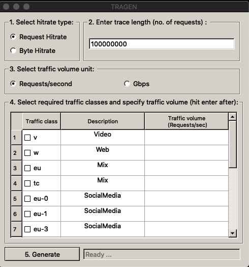

## TRAGEN

TRAGEN is a tool that produces synthetic traces that have similar caching properties as the original traces in the sense that the two traces will have the same hitrates in a cache simulation. TRAGEN is seeded with realistic footprint descriptor models [[1]](#1) computed using original traces from Akamai's production CDNs. Footprint descriptor models capture the caching properties of the original traces. Using footprint descriptors, TRAGEN produces a synthetic trace that fits the model. 

More detailed information about TRAGEN can be found in the [paper at this link](https://groups.cs.umass.edu/ramesh/wp-content/uploads/sites/3/2021/10/imc2021-final270.pdf). Please use the full citation information below when using TRAGEN in your work.

[TRAGEN: A Synthetic Trace Generator for Realistic Cache Simulations](https://groups.cs.umass.edu/ramesh/wp-content/uploads/sites/3/2021/10/imc2021-final270.pdf), by Anirudh Sabnis and Ramesh K. Sitaraman, ACM Internet Measurement Conference (IMC), November 2021.


## 1. Installation

1. Install [python3](https://www.python.org/downloads/).

2. Install the following packages - numpy, scipy, pyQt5 and datetime.
   * ``` pip3 install numpy, scipy, pyQt5, datetime, matplotlib ```

## 2. Use TRAGEN to generate synthetic traces

User can select a traffic model from the [available traffic models](#5-available-traffic-models) to produce a synthetic trace that fits the model.

1. Select a model that is described as *Mix* to generate a synthetic trace that is representative of the original trace obtained from a server that is serving a mix of traffic classes. 

2. Or, select multiple traffic models and provide the required traffic volumes for each selected option to create a custom traffic mix. For e.g., 10Gbps of traffic from Amazon mixed with 5Gbps of traffic from Microsoft.

The user can use a [Command Line Interface](#21-command-line-interface).

### 2.1. Command line interface

Run the following command in the home directory of TRAGEN to operate in the CLI mode.
   * ``` python3 tragen_cli.py -c <config_file> -d <output_directory> ```

#### 2.2.1. Config file

The config file is to be in the json format. An example of a config file is:

```json
{
    "Trace_length": "100000000",
    "Hitrate_type": "bhr",
    "Input_unit"  : "reqs/s",
    "Traffic_classes" : [
        {
            "traffic_class": "v",
            "traffic_volume": "1000"
        },
        {
            "traffic_class":"w",
            "traffic_volume":"2000"
        }
    ]
}
```

1. **Trace_length**. Specify the number of requests in the synthetic trace.
2. **Hitrate_type**. Enter rhr or bhr if the synthetic trace is to have Request hit rate or Byte hit rate, respectively, as the original.
3. **Input_unit**. Enter the unit with which the traffic volume for each traffic class will be specified - reqs/s or Gbps.
4. **Traffic_classes**. Create a custom traffic mix by providing a list of traffic classes and their respective traffic volumes. 
   * traffic_class should be one of the traffic classes specified in the [available traffic models](#5-available-traffic-models).
   * traffic_volume field specifies the traffic volume for the traffic class.

The produced synthetic trace is in the specified <output_directory>.

### 2.2. GUI

Run the following command in the home directory of TRAGEN to display the GUI.
   * ``` python3 tragen_gui.py ```

Below is a screenshot of the GUI. 



1. **Select hit rate type**. Select if the synthetic trace is to have the same Request hit rate or Byte hit rate as the original.
2. **Enter trace length**. Specify the number of requests in the synthetic trace.
3. **Select traffic volume unit**. Select if the traffic volume field in the third column of the table will be input as requests/second or Gigabits per second (Gbps).
4. **Select required traffic classes and specify the traffic volume**. Select traffic classes from the first column of the table and specify a traffic volume for the selected traffic classes in the third column of the table. The second column provides a description of each choice. Each choice is either a pure traffic class  such as video, web, or social media traffic class. Or, it is a traffic mix itself.
5. **Generate**. Hit the generate button and TRAGEN will start producing the synthetic trace.

#### 2.2.2. Output

The produced synthetic trace is found in the directory ./OUTPUT/


## 3. Generate and submit traffic models

#### 3.1 Generate traffic models

A traffic model is a three-tuple consisting of a footprint descriptor, a byte-weighted footprint descriptor, and the object size distribution. To generate traffic models for your own original traces provide the original trace in a file in the following format. Each request in the trace is comma seperated list of timestamp, object_id, and object_size (in Kb). Now, each request is on a new line. For example,

```
timestamp, object_id, object_size (Kb)
1532702631,0,26624
1532702631,1,12288
1532702631,2,26624
1532702631,3,26624
	.
	.
	.
	.
```

Use the following command,
   * ``` python3 traffic_modeler.py <path_to_original_trace> <output_dir>```
   
The output_dir contains the footprint descriptor (fd.txt), byte-weighted footprint descriptors (bfd.txt) and the object size distribution (sz.txt) for the specified trace.

#### 3.2. Submitting traffic models

Consider adding your footprint descriptors to our repository. To do so,

1. Create a directory FOOTPRINT_DESCRIPTOR/<your_traffic_class_name>.
2. Copy the footprint descriptor (named as fd.txt), byte-weighted footprint descriptor (named as bfd.txt) and the object size distribution (sz.txt) to FOOTPRINT_DESCRIPTOR/<your_traffic_class_name>/.
3. Create an entry in [available traffic models](#5-available-traffic-models).
4. Update the file FOOTPRINT_DESCRIPTOR/available_fds.txt

## 4. Developer mode

We welcome users to suggest modifications to improve the quality of the code or add new features to the existing codebase. Use the developer branch to make edits and submit a change.


## 5. Available traffic models

The currently available traffic models are:

| |Traffic class|                        Description| Traffic type|
|:-|:-:|:-------------------------------------------------------------|:--:|
|1|V|Traffic collected from servers predominantly serving video traffic|Video|
|2|W|Traffic collected from servers predominantly serving web traffic|Web|
|3|EU|Traffic collected from a cluster of servers serving a mix of traffic|Mix|
|4|TC|Traffic collected from a cluster of servers serving a mix of traffic|Mix|
|5|EU-0|Subset of eu trace corresponding to media traffic|SocialMedia|
|6|EU-1|Subset of eu trace corresponding to media traffic|SocialMedia|
|8|EU-3|Subset of eu trace corresponding to media traffic|SocialMedia|
|10|EU-5|Subset of eu trace corresponding to media traffic|SocialMedia|
|11|EU-6|Subset of eu trace corresponding to media traffic|SocialMedia|
|12|EU-7|Subset of eu trace corresponding to media traffic|Web|
|13|EU-8|Subset of eu trace corresponding to media traffic|SocialMedia|
|14|EU-9|Subset of eu trace corresponding to media traffic|Web|
|15|TC-0|Subset of tc trace that corresponds to downloads|Download|
|15|TC-1|Subset of tc trace that corresponds to images|Images|
|16|TC-2|Subset of tc trace that corresponds to media|Media|
|17|TC-3|Subset of tc trace that corresponds to web|Web|


## 6. References

<a id="1">[1]</a> 
Sundarrajan, Aditya, Mingdong Feng, Mangesh Kasbekar, and Ramesh K. Sitaraman. "[Footprint descriptors: Theory and practice of cache provisioning in a global cdn](https://groups.cs.umass.edu/ramesh/wp-content/uploads/sites/3/2019/12/Footprint-Descriptors-Theory-and-Practice-of-Cache-Provisioning-in-a-Global-CDN.pdf)." In Proceedings of the 13th International Conference on emerging Networking EXperiments and Technologies, pp. 55-67. 2017.

## 7. Acknowledgements
This work was supported in part by NSF grants CNS-1763617 and CNS-1901137.
